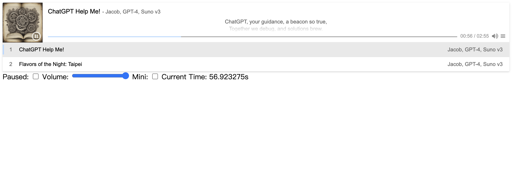

# Svelte Audio

Audio Player Component for Svelte.

> It uses [APlayer](https://github.com/DIYgod/APlayer) under the hood!

## Installation

```bash
pnpm i -D svelte-audio
```

## Usage

```html
<script lang="ts">
    import { Audio } from "svelte-audio";
    import { playlist } from "./playlist";

    let paused = false;
    let time = 0;
    let volume = 1;
    let mini = false;
</script>

<Audio bind:paused bind:time bind:volume bind:mini {playlist}>
    <div>Loading ...</div> <!-- Loading Slot -->
</Audio>

Paused: <input type="checkbox" bind:checked={paused} />
Volume: <input type="range" min="0" max="1" step="0.01" bind:value={volume} />
Mini: <input type="checkbox" bind:checked={mini} />
Current Time: {time}s
```

<details>
<summary>playlist.ts</summary>

```ts
import type { Playlist } from "svelte-audio";

export const playlist: Playlist = [
    {
        name: "ChatGPT Help Me!",
        artist: "Jacob, GPT-4, Suno v3",
        cover: new URL("https://cdn1.suno.ai/image_6aee2edf-ba1e-4394-b75e-7385261c4e07.png"),
        url: new URL("https://cdn1.suno.ai/ebb95c9f-ef34-4cd1-b0f1-d8a97666550a.mp3"),
        lrc: new URL("https://storage.jacoblin.cool/ChatGPT-Help-Me.lrc"),
    },
    {
        name: "Flavors of the Night: Taipei",
        artist: "Jacob, GPT-4, Suno v3",
        cover: new URL("https://cdn1.suno.ai/image_3400c31e-d6ec-4101-80b1-1ae11dd3d220.png"),
        url: new URL("https://cdn1.suno.ai/3400c31e-d6ec-4101-80b1-1ae11dd3d220.mp3"),
        lrc: new URL("https://storage.jacoblin.cool/empty.lrc"),
    },
];
```

</details>



To see the full list of props, check out the [Storybook](https://jacoblincool.github.io/svelte-audio).
